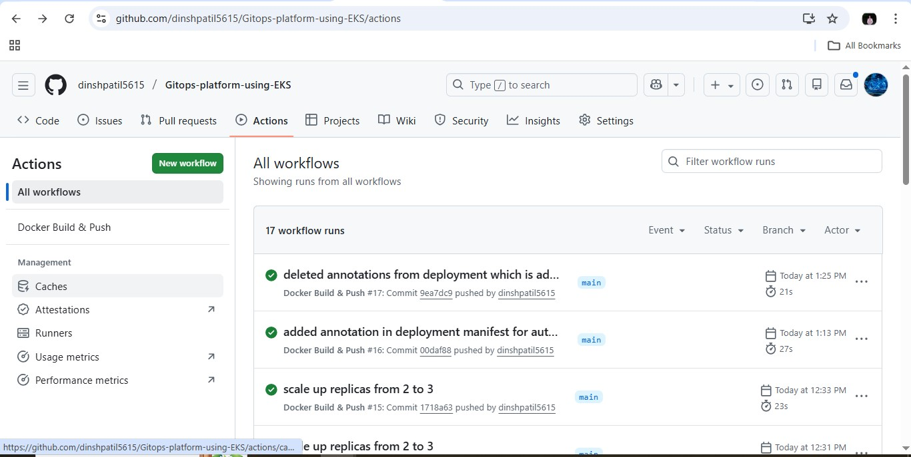
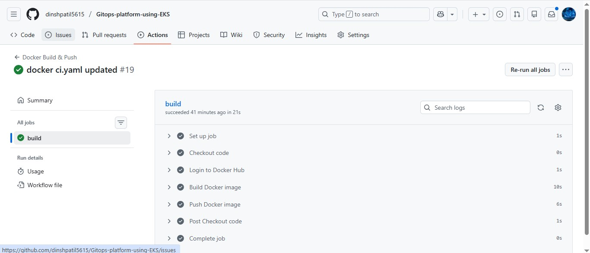
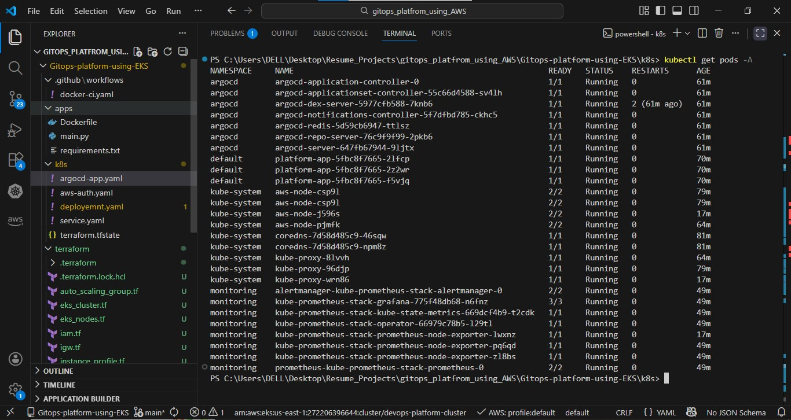

# 🚀 GitOps Platform using AWS EKS

A complete end-to-end **DevOps GitOps platform** built using AWS, Kubernetes, GitHub Actions, Argo CD, and Prometheus-Grafana.

This project demonstrates how modern DevOps teams implement **CI/CD, GitOps, Monitoring, and Infrastructure as Code** in production.

---

## 🧠 Project Overview

This platform automatically:
- Builds Docker images on every Git push
- Pushes images to Docker Hub
- Deploys applications to Kubernetes using Argo CD (GitOps)
- Monitors cluster and application health using Prometheus & Grafana

---

## 🏗️ Architecture Diagram


---

## 🛠️ Tools & Technologies Used

| Category | Tools |
|-------|------|
| Cloud | AWS |
| Infrastructure as Code | Terraform |
| Container Orchestration | Kubernetes (EKS) |
| CI | GitHub Actions |
| CD (GitOps) | Argo CD |
| Container Registry | Docker Hub |
| Monitoring | Prometheus |
| Visualization | Grafana |
| Packaging | Helm |

---

## 🔄 CI/CD Flow (How it works)

### 1️⃣ Continuous Integration (CI)
- Triggered on every push to `main`
- GitHub Actions:
  - Builds Docker image
  - Tags image with Git commit SHA
  - Pushes image to Docker Hub

📸 
📸 

---

### 2️⃣ Continuous Delivery (GitOps with Argo CD)
- Argo CD watches Kubernetes manifests in GitHub
- Automatically syncs changes to EKS
- Ensures desired state matches Git state
- Auto-heals drifted resources

📸 

---

### 3️⃣ Kubernetes Deployment
- Application runs as a Deployment
- Exposed via Service
- Scales using replicas
- Managed declaratively via Git

📸 

---

### 4️⃣ Monitoring & Observability
- Prometheus collects cluster & pod metrics
- Grafana visualizes:
  - CPU usage
  - Memory usage
  - Pod health
  - Namespace metrics

📸 

---

## 📁 Repository Structure

```text
.
├── terraform/          # EKS infrastructure (IaC)
├── k8s/                # Kubernetes manifests
├── apps/               # Application source & Dockerfile
├── .github/workflows/  # GitHub Actions CI
├── screenshots/        # Project screenshots
└── README.md
